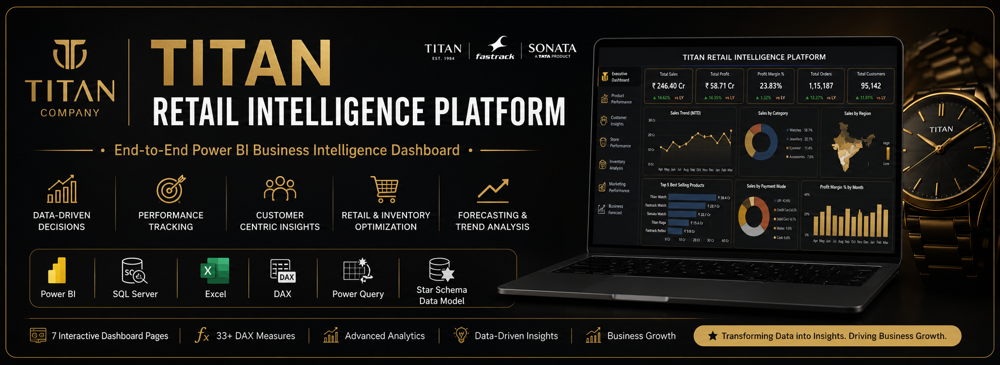
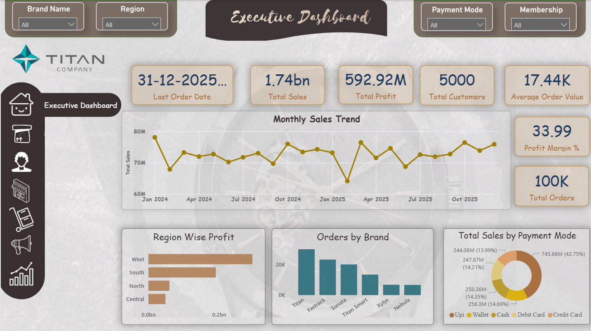
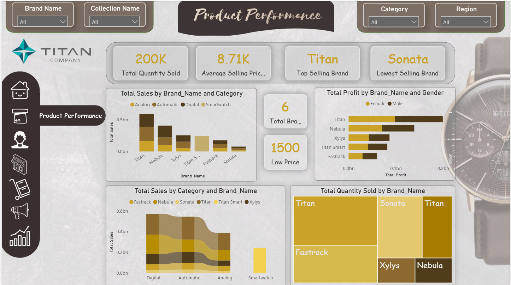
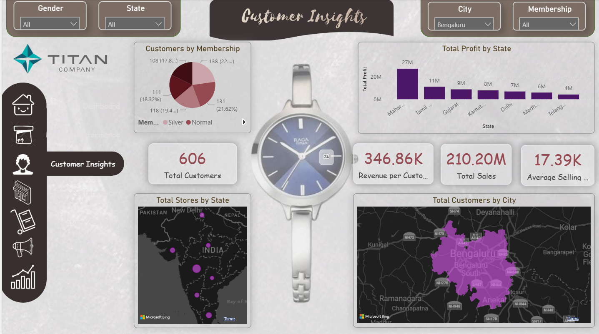
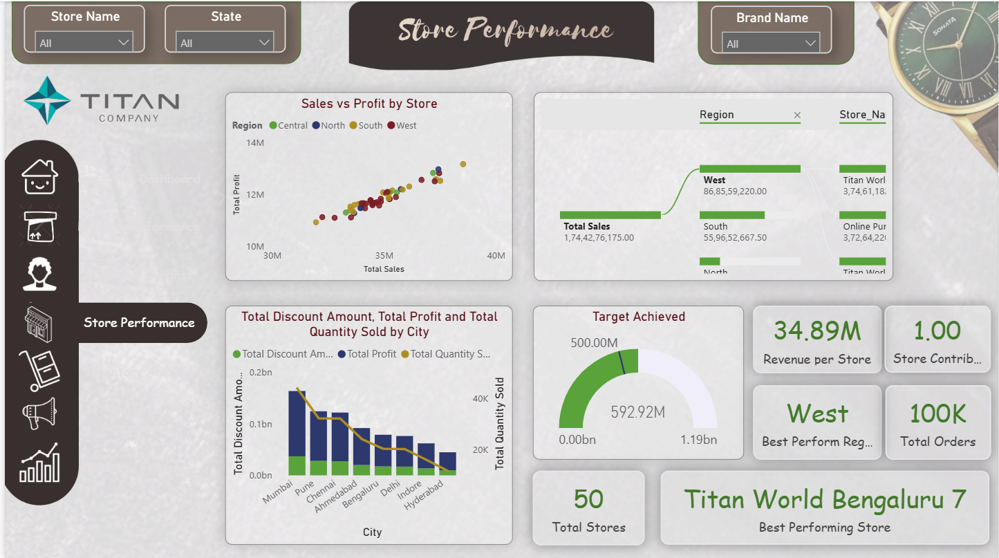
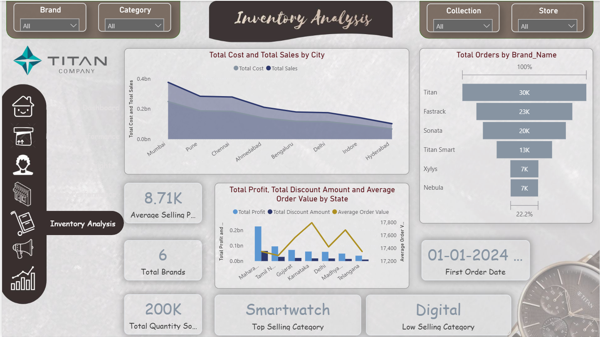
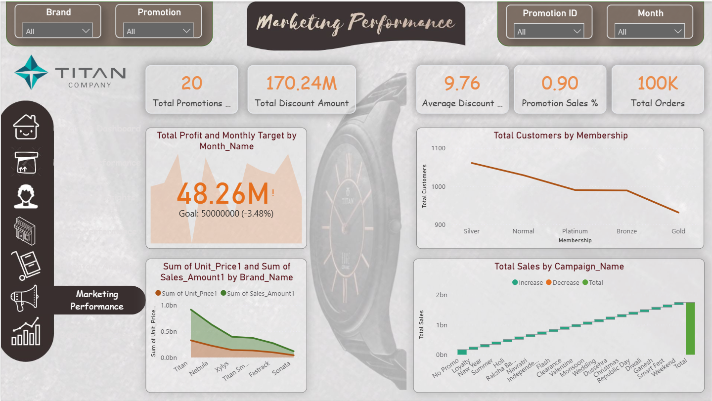
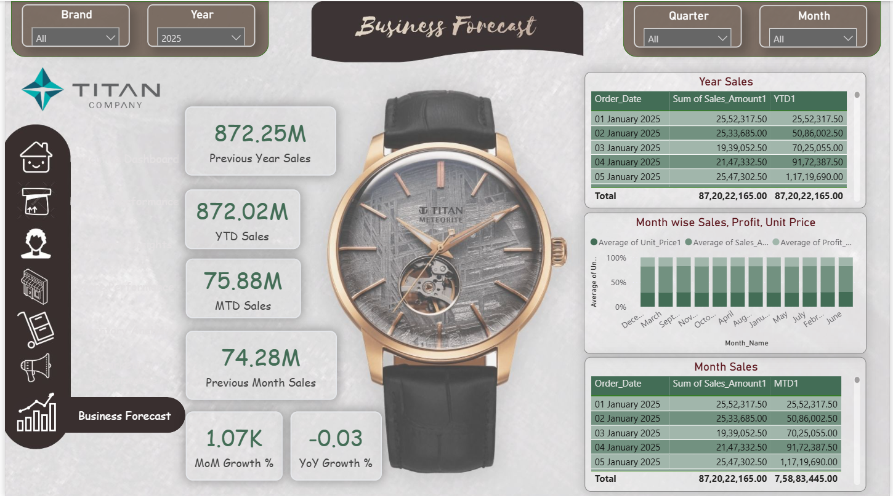

# Titan Retail Intelligence Platform

An interactive Power BI dashboard for retail sales analysis using data modeling, DAX, and business intelligence techniques.

  

## 📌 Project Overview

Titan Retail Intelligence Platform is an end-to-end Business Intelligence project developed using Microsoft Power BI. The project transforms retail sales data into meaningful business insights through interactive dashboards, data modeling, and DAX calculations.

The dashboard enables businesses to monitor sales performance, analyze customer behavior, evaluate product performance, track store efficiency, assess marketing campaigns, and forecast future business trends.

## 🛠️ Tech Stack

- **Data Visualization:** Microsoft Power BI
- **Data Transformation:** Power Query
- **Data Modeling:** Star Schema
- **Language:** DAX (Data Analysis Expressions)
- **Dataset Format:** Microsoft Excel (.xlsx)

## ✨ Project Features

- 📊 Interactive Power BI dashboards
- 📈 Sales and profit performance analysis
- 📦 Product and brand performance insights
- 👥 Customer behavior analysis
- 🏪 Store and regional performance tracking
- 📣 Marketing campaign performance evaluation
- 📦 Inventory monitoring and analysis
- 📅 Time intelligence using MTD, YTD, MoM, and YoY metrics
- 📉 Business forecasting and trend analysis
- 🎯 Interactive slicers and cross-filtering

## 🎯 Business Problem

Retail businesses generate large volumes of sales data every day. However, raw data alone does not provide meaningful insights for decision-making.

The objective of this project is to transform raw retail sales data into an interactive Business Intelligence solution that helps stakeholders monitor performance, identify trends, evaluate key business metrics, and make data-driven decisions.

## 🎯 Project Objectives

- Develop an interactive Business Intelligence dashboard for retail sales analysis.
- Analyze sales, profit, customer, product, and store performance.
- Monitor key business KPIs through dynamic visualizations.
- Enable interactive filtering and drill-down analysis.
- Support data-driven decision-making using DAX calculations and Power BI.
- Present business insights in a clear and visually appealing format.

## ⭐ Data Model

The project follows a **Star Schema** data model to ensure efficient data organization and analytical performance.

### Fact Table
- Fact_Sales

### Dimension Tables
- Dim_Product
- Dim_Customer
- Dim_Store
- Dim_Date
- Dim_Promotion
- Dim_Inventory

The Star Schema enables faster query performance, simplified relationships, and scalable business reporting.

## 📊 Dashboard Pages

The Titan Retail Intelligence Platform consists of **7 interactive dashboard pages**, each designed to analyze a specific aspect of the retail business.

### 1. Executive Dashboard
Provides an overview of key business KPIs including Total Sales, Total Profit, Orders, Customers, and overall business performance.

### 2. Product Performance
Analyzes product, brand, and category performance to identify top and bottom-performing products.

### 3. Customer Insights
Explores customer demographics, purchasing behavior, payment preferences, and customer contribution to sales.

### 4. Store Performance
Evaluates store-wise and regional performance using sales, profit, and operational KPIs.

### 5. Inventory Analysis
Monitors inventory levels, stock availability, reorder requirements, and product movement.

### 6. Marketing Performance
Measures promotion effectiveness, discount impact, campaign performance, and marketing contribution.

### 7. Business Forecast
Provides future sales forecasting and trend analysis to support strategic business planning.

## 📈 Key DAX Measures

The dashboard leverages DAX (Data Analysis Expressions) to calculate key business metrics and support interactive reporting.

Some of the important measures include:

- Total Sales
- Total Profit
- Total Orders
- Total Customers
- Total Quantity Sold
- Average Order Value (AOV)
- Average Selling Price (ASP)
- Profit Margin %
- Revenue per Customer
- Total Products Sold
- Total Brands
- Promotion Sales %
- Average Discount %
- Store Contribution %
- Return Rate %
- Month-to-Date (MTD) Sales
- Year-to-Date (YTD) Sales
- Previous Month Sales
- Previous Year Sales
- Month-over-Month (MoM) Growth
- Year-over-Year (YoY) Growth

Overall, the project includes **33+ DAX measures** that enable dynamic KPI tracking and advanced business analysis.

## 🎥 Dashboard Demo

Watch the dashboard walkthrough to explore the interactive features and business insights.

📹 **Demo Video:** [Titan Retail Intelligence Platform Demo](Demo/Titan_Dashboard_Demo.mp4)

## 📷 Dashboard Preview

### 🏆 Executive Dashboard

---

### 📦 Product Performance

---

### 👥 Customer Insights

---

### 🏪 Store Performance

---

### 📦 Inventory Analysis

---

### 📣 Marketing Performance

---

### 📈 Business Forecast

## 💡 Business Insights

The dashboard enables decision-makers to gain actionable insights, including:

- Which products generate the highest revenue?
- Which stores contribute the most to overall sales?
- Which customer segments are most valuable?
- Which marketing campaigns perform best?
- What are the monthly and yearly sales trends?
- Which payment methods are preferred by customers?
- How effectively is inventory being managed?
- What future sales trends can be expected?

## 🚀 How to Explore the Project

1. Open the dashboard screenshots to explore the report pages.
2. Watch the demo video to see the dashboard in action.
3. Download the Power BI (.pbix) file to interact with the report.
4. Review the dataset and presentation for additional project details.

## 🔮 Future Enhancements

Potential improvements for future versions include:

Real-time Data Integration

Automated Data Refresh

Cloud Deployment

Row-Level Security (RLS)

Mobile Dashboard Optimization

AI-driven Insights

## 🙏 Acknowledgements

This project was developed as part of my Data Analyst learning journey to apply Business Intelligence concepts using Microsoft Power BI. It demonstrates practical skills in data modeling, DAX, visualization, and business analytics through an end-to-end retail sales analysis project.

## 👨‍💻 Author

**Prathamesh Choudhary**

Data Analyst | Power BI | SQL | Excel | Python

If you found this project useful, consider giving it a ⭐ on GitHub.

## 📜 License

This project is licensed under the MIT License.
